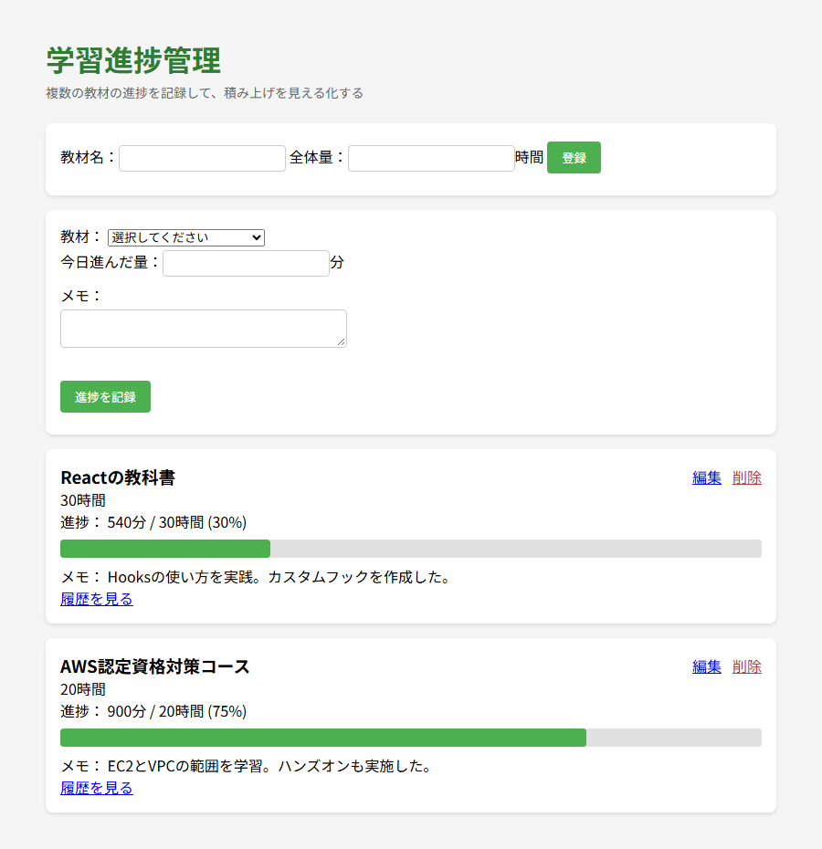
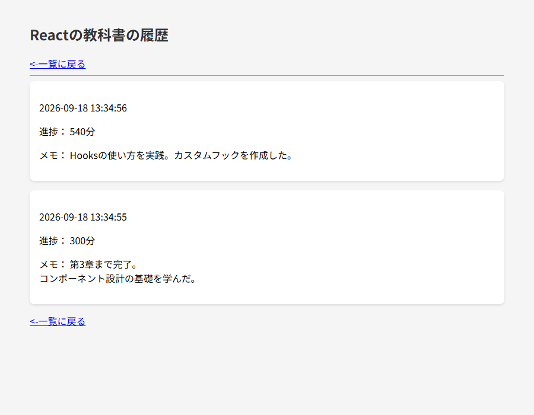

# 📚 Study Progress App（学習進捗管理アプリ）

> **一言で説明**: 複数の学習教材の進捗を記録・可視化し、学習のモチベーション維持を助ける Web アプリです。

## 📖 概要

このアプリは、オンライン学習の進捗管理を通じて「学習を続けられること」を支えるために開発しました。

### なぜ作ったのか

オンライン学習（Udemy など）では、1 つの教材が数十時間に及ぶことも珍しくありません。総量が大きいほどゴールが遠く感じられ、少し取り組んでも達成感が得にくいという課題があります。また、複数の教材を並行して進めると、それぞれがどこまで進んだのか把握しづらくなります。

私自身がまさにこの状況に置かれ、「進んだ実感が持てずモチベーションが続かない」「複数教材の進捗が混ざって分からなくなる」という悩みを抱えていました。この 2 つを解決するために、進捗を数値と進捗バーで可視化するアプリを作りました。

## ✨ 主な機能

- **教材の登録** — 教材名と全体量（時間）を登録する
- **進捗の記録** — 「今日進んだ分」を分単位で入力すると、自動で累計に加算される（足し算方式）
- **進捗の可視化** — 完了率をパーセントと進捗バーで表示する
- **教材の一覧表示** — 登録した全教材の進捗を横断的に確認できる
- **メモ機能** — 各記録に複数行のメモを残せる
- **履歴表示** — 過去の進捗記録を別ページで日時・メモとともに一覧できる

## 🛠 技術スタック

| カテゴリ | 技術 |
|:--|:--|
| バックエンド | PHP（PDO） |
| データベース | MySQL |
| フロントエンド | HTML / CSS |

## 🏗 データベース設計

教材そのものの情報と、日々の進捗記録を別のテーブルに分けて管理しています。1 つの教材に対して進捗の記録が何度も追加されるため、「変わらない情報（教材）」と「増えていく記録（進捗）」を分離する設計にしました。

### materials テーブル（教材）

| カラム | 型 | 説明 |
|:--|:--|:--|
| id | INT AUTO_INCREMENT PRIMARY KEY | 教材の識別番号 |
| title | CHAR(64) | 教材名 |
| total_amount | INT | 全体量（時間） |
| created_at | TIMESTAMP | 登録日時 |

### progress テーブル（進捗記録）

| カラム | 型 | 説明 |
|:--|:--|:--|
| id | INT AUTO_INCREMENT PRIMARY KEY | 記録の識別番号 |
| material_id | INT | どの教材の記録か（materials の id と紐づく） |
| done_amount | INT | 累計進捗（分） |
| memo | TEXT | メモ（複数行対応） |
| created_at | TIMESTAMP | 記録日時 |

`progress` の `material_id` が `materials` の `id` と対応することで、2 つのテーブルを紐づけています。

## 💡 工夫した点

- **2 テーブル構成による設計** — 教材と進捗記録を分離し、1 つの教材に複数の進捗記録が紐づく構造にした。
- **DB 接続情報の分離** — データベースの接続情報を `db_connect.php` に切り出し、`.gitignore` で除外することで、パスワードなどの機密情報を GitHub に公開しないようにした。接続設定の見本として、伏字にした `db_connect.php.sample` を用意している。
- **足し算方式の進捗記録** — 毎回累計を計算して入力するのではなく「今日進んだ分」だけを入力すれば自動で累計に加算される方式にし、入力の手間を減らした。
- **単位の使い分け** — 全体量は時間で登録し、進捗は分単位で記録。完了率の計算時に単位を換算して整合を取っている。

## 📂 ファイル構成

| ファイル | 役割 |
|:--|:--|
| `m6_main.php` | メイン画面。教材の登録、進捗の記録、教材一覧・進捗バーの表示 |
| `m6_history.php` | 履歴画面。指定した教材の全進捗記録を日時・メモで一覧表示 |
| `m6_table_create.php` | テーブル作成用スクリプト |
| `style.css` | 画面の装飾（カード型レイアウト、進捗バー） |
| `db_connect.php.sample` | DB 接続設定の見本（実際の接続情報は伏字） |

## 🚀 はじめ方

### 前提条件

- PHP が動作するサーバー環境
- MySQL

### セットアップ

\`\`\`bash
# リポジトリをクローン
git clone https://github.com/Chii09/study-progress-app.git
cd study-progress-app

# 接続設定ファイルを作成
cp db_connect.php.sample db_connect.php
# db_connect.php を編集し、自分のデータベース接続情報を記入する
\`\`\`

続いて、テーブルを作成してアプリにアクセスします。

1. `m6_table_create.php` にアクセスしてテーブルを作成する
2. `m6_main.php` にアクセスする

## 📝 画面

### メイン画面

教材の一覧と進捗バー、登録・記録フォーム

### 履歴画面

選んだ教材の進捗記録を時系列で表示

## 🔭 今後の展望

- ユーザー登録・ログイン機能を追加し、自分専用のツールから複数人が使えるサービスへ発展させる
- 進捗の推移をグラフで表示し、積み上げの実感を強化する
- 教材の編集・削除機能を追加し、運用に耐えるアプリに仕上げる

## 👤 作者

熊谷 知隼（[@Chii09](https://github.com/Chii09)）